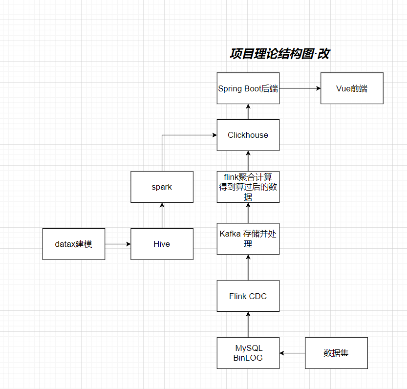
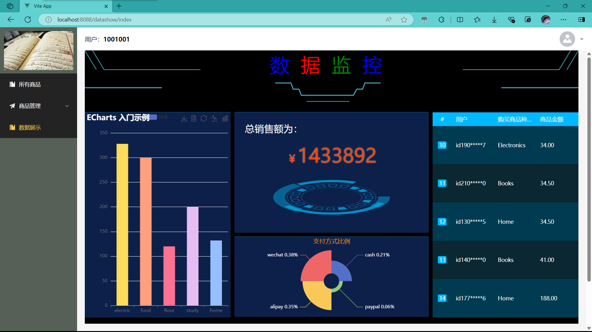

# FullyStar

###### 软工21级小组作业

进入你想要的目录，使用 ``` git clone https://github.com/mikuay12/FullyStar.git ``` 拉取项目


###### 项目结构



- 使用了基于Flink的实时计算技术
- 基于多台Linux的分布式架构
- 使用了Vue3和Spring Boot的前后端技术 
- 实现了数据的实时可视化


